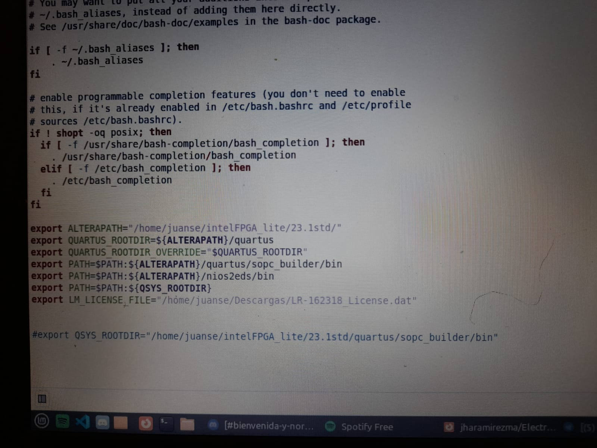

*Instalación de Linux Mint/Ubuntu*
-

Principalmente fue necesario dirigirse a la pagina respectiva de la distribución a utilizar que para algunos de los integrantes de este grupo fue Mint, mientras que para otros fue Ubuntu, ya con esto, se procede a descargar el archivo correspondiente y posterior a esto se realizó la preparación del mismo en dispositivos USB que luego serían usados al momento de la instalación.

Para poder realizar la instalación correctamente del OS Linux, ya fuera para su distribución Ubuntu o Mint, fue necesario realizar primeramente la respectiva partición del disco, de manera que desde Windows, en el apartado correspondiente a "Administración de discos" se realizó la respectiva partición, tal como se puede ver en la imagen 1, se dispuso de 100Gb para esdta partición y ya con esto realizado, se procede a reallizar la instalación del OS.


Ya con esto realizado, se apaga el dispositivo. Antes de encenderlo nuevamente, se conecta la USB que contiene la distribución de Linux, de manera que al encenderlo y dirigirse a la BIOS, se pueda acceder a la misma y comenzar a ejecutar el archivo de instalación del OS. 

*Instalación de Quartus*
--

Habiendo instalado Linux, se procedió a realizar la instalación de Quartus, para esto, en la pagina de decarga de la misma, se procedió a seleccionar la versión a utilizar, la cual, para esta ocasión es _Lite Edition_. Posterior a la descarga del mismo, se otorgarón permisos con el comando.


   ```chmod +x qinst-lite-linux-23.1std-991.run ```
   
Y posterior a esto, se ejecutó el siguiente comando

   ``` ./qinst-lite-linux-23.1std-991.run```

Lo anterior se realizó, tal y como se mevidencia en la imagen de la figura 2.


Figura 2 (Línea de comandos)

De esta manera se ejecutó el instalador de Quartus, en el cual, fueron seleccionadas todas las casillas para posteriormente realizar las descargas respectivas de todas  las dependencias. Posterior a esto, se presentó un incidente en la instalación, la cual no permitía instalar automáticamente las dependencias descargadas. Razón por la cual, se optó por evitar la instalación automática y realizar más bien la instalación manual de cada una de las dependencias. 


Figura 3 (Errores de instalación)


Figura 4 (Dependencias descargadas y unselect de la instalación automática)

Ya habiendo instalado Quartus, era necesario diligenciar el siguiente texto en el archivo .bashrc:

```

    export ALTERAPATH="/home/user*/intelFPGA_lite/23.1std/"
    export QUARTUS_ROOTDIR=${ALTERAPATH}/quartus
    export QUARTUS_ROOTDIR_OVERRIDE="$QUARTUS_ROOTDIR"
    export PATH=$PATH:${ALTERAPATH}/quartus/sopc_builder/bin
    export PATH=$PATH:${ALTERAPATH}/nios2eds/bin
    export PATH=$PATH:${QSYS_ROOTDIR}

```

Y tambien comentar una seccion del mismo archivo, poniendo un # al inicio de la misma.

``` #export QSYS_ROOTDIR="/home/juanse/intelFPGA_lite/23.1std/quartus/sopc_builder/bin" ```

Por lo cual nos dirigimos a la carpeta principal del usuario, en este caso la carpeta "juanse" y se habilitó la opción de mostrar archivos ocultos, gracias a esto fue posible visualizar el respectivo archivo .bashrc y realizar las modificaciones respectivas.


Figura 5 (Archivo .bashrc modificado)

Por último, para crear un enlace simbolico con quartus, se ejecutó el comando:

```  sudo ln -s $QUARTUS_ROOTDIR/bin/quartus /bin/quartus ```


Figura 6 (Enlace simbólico creado)


*Instalación de Questa*
--
  
 Primero en MicrosoftOnline.com podemos obtener los dos paquetes que harán las veces de instalador para nuestro software Questa. debemos descargar los dos tipos de paquetes, el de tipo .run y el .qdz. Descargados los archivos otorgamos permisos con el comando chmod +x *.run y seguido ./*.run 

   

   damos clic en siuiente y elegimos la edición Intel FPGA Starter Edition, aceptamos términos y condiciones y procedemos a completar la instalación.


*Obtención licencia de Questa*
ingresamos al Self-Service Licensing Center de Intel para crear una cuenta en intel azure portal e inscribirse
en la opción Enroll for Intel® FPGA Self Service Licensing Center (SSLC).
Confirmamos nuestra cuenta usando nuestro teléfono móvil.


Tras guardar y generar dicha licencia nos llegará a nuestro correo un archivo .dat que nos permitirá vincular la licencia con nuestro software.


Ya con la cuenta creada en el portal elegimosla opción Sing up for Evaluation or No-Cost License.
y seleccionamos la opción la opción Questa*-Intel® FPGA Starter.

Llenamos los campos de computer name, type license, computer type y Primary Computer ID.


*Descarga e implementación de la licencia de Intel para habilitar el uso de Questa en Quartus*
