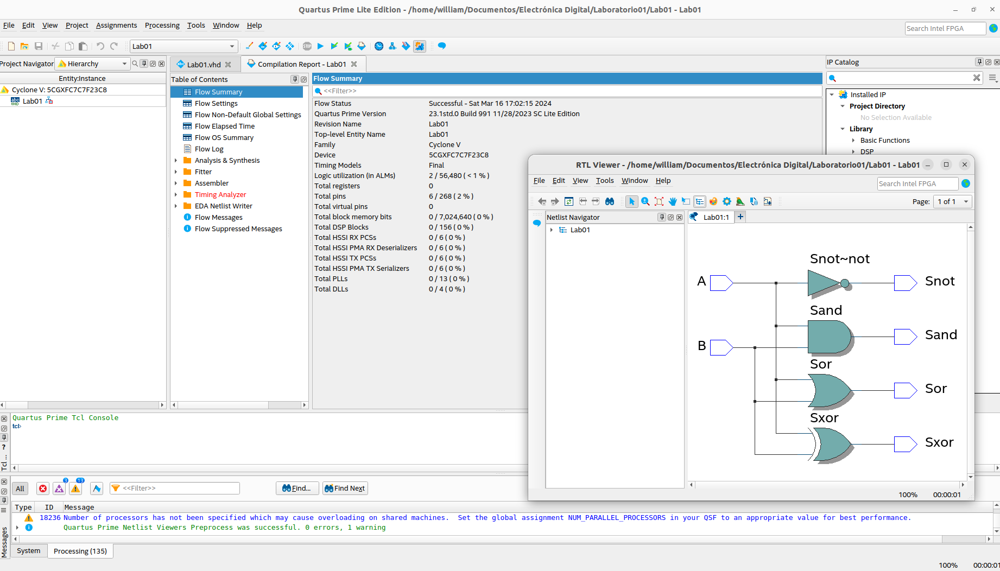

*Cración y desarrollo del proyecto en Quartus*
-

En principio, se debe correr el entorno de desarrollo dec Quartus y seleccionar la opción *New Project Wizard*, desde la cual se deben seguir lo pasos de creación del proeyecto. Se recomienda destinar una carpeta específica para el proyecto, por ahora no adicionar archivos al proyecto y como se trata de una simulación cualquier FPGA debería funcionar.

Para la configuración con Questa, se selcciona de esta forma

Una vez creado el proyecto se agrega un nuevo archivo de tipo VHDL, en el cual se redacta el código para describir las compuertas deseados.
En primer lugar se usa la libreria del IEEE para *Standard Logic* como
  
    ```Library IEEE;```
    ```use ieee.std_logic_1164.all;```
Posteriormente se definen los pines de entrada y salida en ```Entity``` dandoles tipo *std_logic*. Después se define la arquitectura como el flujo de datos para estos pines, con cada salida como la operación de las entradas

Asegurandose de no tener errores en código se procede a hacer la compilación y visualizar la forma en qué compilo una vez sea exitosa.
*COMPUERTAS A SIMULAR: Not , and , or*

COMPUERTA NOT

COMPUERTA AND


tABLA DE VERDAD AND



