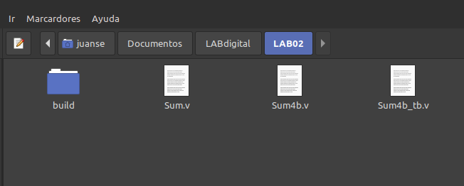
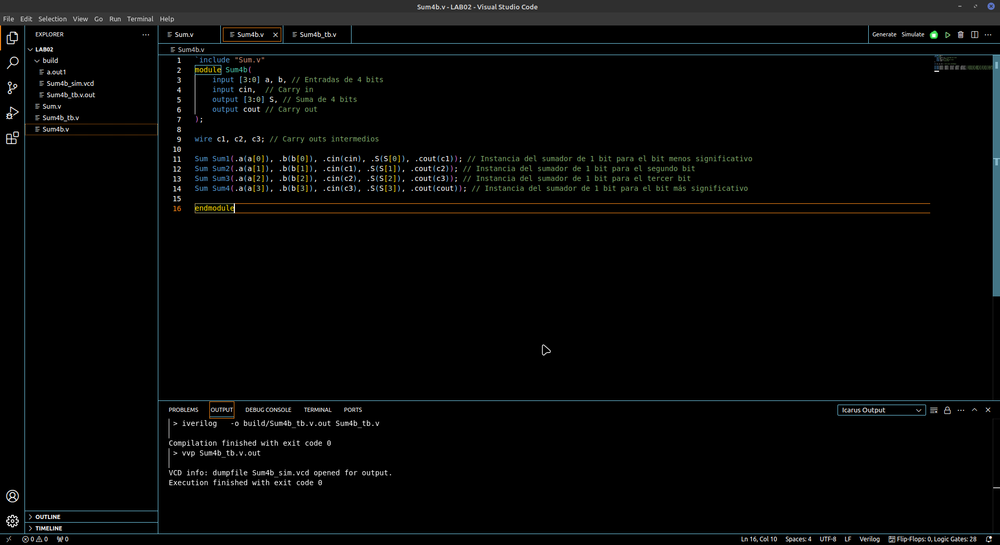
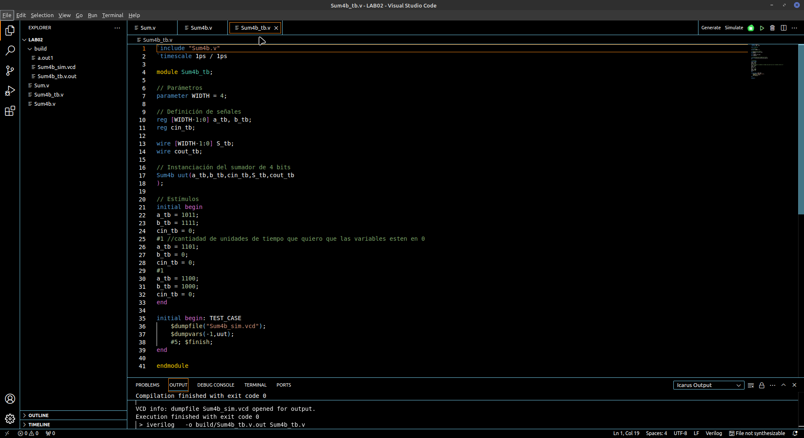
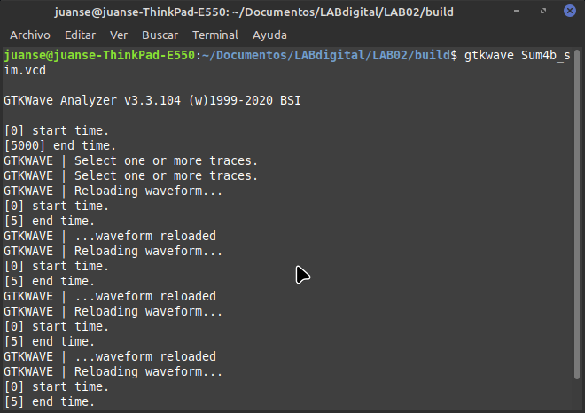
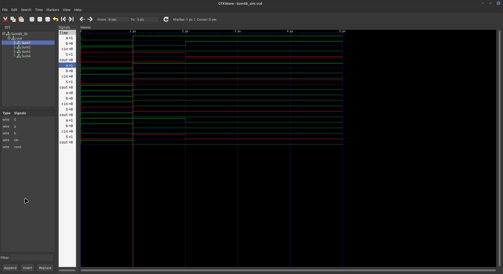
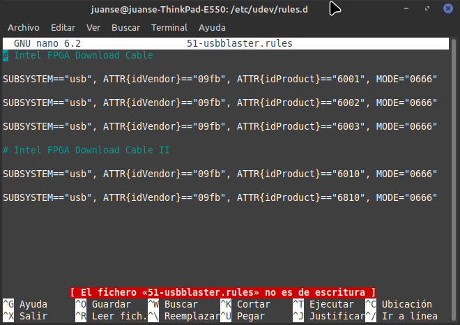

# Lab 02: Implementación de sumador de 1 bit y de 4 bits en FPGA.

## Sumador de 4 bits

Este laboratorio inició con la construcción de un sumador de 4 bits, para el cual se instancia el sumador de 1 bit creado en el laboratorio 01, para de esta manera encadenarlos y lograr tener el sumador de 4 bits correctamente. Es por este motivo que se prefirió ubicar el sumador de 1 bit en la misma carpeta en la cual se iba a crear e implementar el sumador de 4 bits, buscando facilitar la instanciación del primero.

Ya con esto, se procedió a crear el sumador de 4 bits utilizando VScode como herramienta para describir. Se inició llamando al sumador de 1 bit, para después establecer cuáles iban a ser las respectivas entradas y salidas del sumador. Estableciendo "a" y "b" como entradas, las cuales van a ser entradas de 4 bits, "S" se establece como una salida de 4 bits y los "Carry in" y "Carry out" se definen como una entrada y salida de 1 bit respectivamente. Aparte de esto, se definen los Carry out intermedios (c1, c2, c3) y se procede a instanciar 4 veces el sumador de 1 bit.

- Primero: Establece el bit menos significativo de la suma.
- Segundo: Establece el segundo bit.
- Tercero: Tercer bit de la suma.
- Cuarto: Equivale al bit más significativo de la suma.

Es entonces en la cuarta instancia donde se ubica el Carry out.

Ya teniendo el sumador de 4 bits construido se continuó con la realización del respectivo Test bench, para este, se instanció el archivo Sum4b.v que corresponde al sumador de 4 bits y se entregaron entradas de prueba de varios valores. Al final del mismo, se estableció la creación del TEST_CASE, para poder crear el archivo .vcd necesario para realizar la respectiva simulación.

Ya con el archivo .vcd creado, en la terminal se inicializa el simulador GTKwave para abrir el archivo anteriormente mencionado y verificar el correcto funcionamiento del sumador.

De la simulación presentada se puede observar que el sumador opera en óptimas condiciones, como era esperado.

## Configuración del programador (USB-blaster) de la FPGA

Ahora, para poder implementar tanto el sumador de 1 bit como el de 4 bits en la FPGA Cyclone IV, fue necesario configurar el USB-blaster en la computadora, de manera que para integrarle correctamente en Linux, se siguió un proceso de configuración de las reglas de udev:

1. **Acceso al directorio de reglas udev**:
   Se ingresó al directorio raíz con `cd /` y luego al directorio de reglas udev con `cd etc/udev/rules.d/`.

2. **Creación del archivo de reglas**:
   Dentro del directorio de reglas, se creó un nuevo archivo llamado `51-usbblaster.rules` con `sudo touch 51-usbblaster.rules`.

3. **Edición del archivo de reglas**:
   Se editó el archivo recién creado utilizando nano en la terminal como editor de texto.

4. **Agregado de las reglas necesarias**:
   Se añadieron las reglas correspondientes al USB-Blaster, incluyendo identificadores de fabricante y producto, así como permisos de acceso.

5. **Recarga de reglas udev**:
   Después de agregar las reglas, se recargó el sistema con `sudo udevadm control --reload-rules` y se reinició el equipo. (El comando `sudo` fue utilizado para dar los permisos requeridos para actualizar las reglas del sistema)

Siguiendo estos pasos cuidadosamente, se logró una configuración exitosa de las reglas de udev para el USB-Blaster de la FPGA en Linux, buscando permitir un reconocimiento dinámico de dispositivos y una comunicación fluida entre la FPGA y el sistema operativo.

## Implementación del sumador de 1 bit

Para la implementación de este, se utilizó la herramienta Quartus, en la cual, se creó un nuevo proyecto Wizard y se abrió el archivo verilog que se había elaborado previamente, en el cual se tenía el sumador de 1 bit. Posterior a cargar el archivo .v en el proyecto, se sintetizó, para verificar su correcto funcionamiento y se procedió a establecer los pines de entrada y salida. En este caso, fueron seleccionados como pines de entrada los pines 58 y 59, mientra que, para los pines de salida, fueron seleccionados los pines 74 y 73, correspondientes a los diodos LED D5 y D4 respectivamente. Para el caso del pin de salida 73, este viene representando el resultado de la suma y el pin 74 representa el Carry Out.

## Implementación del sumador de 4 bits

https://drive.google.com/file/d/1n4_vGHJkLs9NriLL48p_FoYGlR4W2K7c/view?usp=drive_link 
