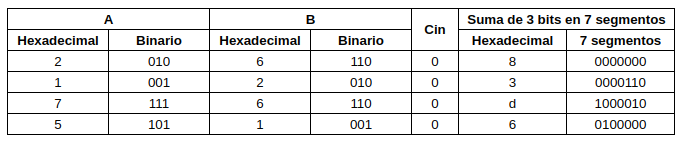

# Lab 03: Implementación de 7 segmentos

## Números en hexadecimal

Para la representación de los números en formato hexadecimal mediante la FPGA, se utilizó el siguiente código:

```verilog
module BCDtoSSeg(
  input [3:0] BCD,
  output reg [0:6] SSeg,
  output [3:0] an
);

  always @(*) begin
    case (~BCD)
      // abcdefg
      4'b0000: SSeg = 7'b0000001; // "0"  
      4'b0001: SSeg = 7'b1001111; // "1" 
      4'b0010: SSeg = 7'b0010010; // "2" 
      4'b0011: SSeg = 7'b0000110; // "3" 
      4'b0100: SSeg = 7'b1001100; // "4" 
      4'b0101: SSeg = 7'b0100100; // "5" 
      4'b0110: SSeg = 7'b0100000; // "6" 
      4'b0111: SSeg = 7'b0001111; // "7" 
      4'b1000: SSeg = 7'b0000000; // "8"  
      4'b1001: SSeg = 7'b0000100; // "9" 
      4'hA: SSeg = 7'b0001000;    // "A"
      4'hB: SSeg = 7'b1100000;    // "B"
      4'hC: SSeg = 7'b0110001;    // "C"
      4'hD: SSeg = 7'b1000010;    // "D"
      4'hE: SSeg = 7'b0110000;    // "E"
      4'hF: SSeg = 7'b0111000;    // "F"
      default: SSeg = 7'b1111111; // Apagar todos los segmentos si no es un BCD válido
    endcase
  end
  assign an = 4'b1110;
endmodule
```


En el cual se toma un número BCD de 4 bits como entrada (BCD) y genera las señales para mostrar este número en un display de siete segmentos. Además, también genera las señales de control para activar un display de ánodo común. Notese que ha sido necesario negar la salida para el correcto funcionamiento del mismo, ya que la lógica de la FPGA es negada.

Por otro lado la disposición de pines se realizó de la siguiente manera:


Para la simulación se creó el siguiente testbench y se ejecutó la simulación empleando Questa.
```verilog
`timescale 1ns / 1ns
module tb_BCDtoSSeg;

	//Definicion de señales de entrada y salida
	reg [3:0] A;
	wire [0:6] sseg;
	wire [3:0] an;

	// Instancia del codificador a siete segmentos
  BCDtoSSeg Display(
    .BCD(A),
    .SSeg(sseg),
    .an(an)
  );
	// Estimulos, casos a simular
	initial begin
	A = 4'b0010;
   #20;
	A = 4'b1001;
	#20;
	A = 4'b0111;
	#20;
	A = 4'hb;
	#20;
	A = 4'he;
	#20;
	end
endmodule 
```
Para los cuatro casos probados: 2, 7, 9, b y e. Se obtiene la siguiente simulación corroborando los resultados esperados.


## Números en decimal

Para visualizar los números decimales (solamente del 0 al 9), se limitó el código anterior, borrando todo lo que fuese después del número 9 y estableciendo que para cualquier valor de BCD inválido se apagaran todos los segmentos.


```verilog
module BCDtoSSeg(
  input [3:0] BCD,
  output reg [0:6] SSeg,
  output [3:0] an
);

  always @(*) begin
    case (~BCD)
      // abcdefg
      4'b0000: SSeg = 7'b0000001; // "0"  
      4'b0001: SSeg = 7'b1001111; // "1" 
      4'b0010: SSeg = 7'b0010010; // "2" 
      4'b0011: SSeg = 7'b0000110; // "3" 
      4'b0100: SSeg = 7'b1001100; // "4" 
      4'b0101: SSeg = 7'b0100100; // "5" 
      4'b0110: SSeg = 7'b0100000; // "6" 
      4'b0111: SSeg = 7'b0001111; // "7" 
      4'b1000: SSeg = 7'b0000000; // "8"  
      4'b1001: SSeg = 7'b0000100; // "9" 
      default: SSeg = 7'b1111111; // Apagar todos los segmentos si no es un BCD válido
    endcase
  end
  assign an = 4'b1110;
endmodule
```

Para este caso, el testbench tiene la misma estructura que el que se utilizó para la visualización de números en hexadecimal. Comprobando esta vez el funcionamiento, dando otros valores de entrada.


## Sumador de 3 bits

Para implementar el sumador de 3 bits en la FPGA y poder visualizar el resultado en los displays de la misma. primero se construyó el respectivo sumador, instanciando al sumador de 1 bit creado en el primer laboratorio.

```verilog
`include "Sum.v"
module Sum3b(
    input [2:0] a, b, // Entradas de 3 bits
    input cin,  // Carry in
    output [2:0] S, // Suma de 3 bits
    output cout // Carry out
);

wire c1, c2; // Carry outs intermedios

Sum Sum1(.a(a[0]), .b(b[0]), .cin(cin), .S(S[0]), .cout(c1)); // Instancia del sumador de 1 bit para el bit menos significativo
Sum Sum2(.a(a[1]), .b(b[1]), .cin(c1), .S(S[1]), .cout(c2)); // Instancia del sumador de 1 bit para el segundo bit
Sum Sum3(.a(a[2]), .b(b[2]), .cin(c2), .S(S[2]), .cout(cout)); // Instancia del sumador de 1 bit para el bit más significativo

endmodule

```

### Simulación del sumador de 3 bits
```verilog
`include "Sum3b.v"
`timescale 1ps / 1ps

module Sum3b_tb;

// Parámetros
parameter WIDTH = 3;

// Definición de señales
reg [WIDTH-1:0] a_tb, b_tb;
reg cin_tb;

wire [WIDTH-1:0] S_tb;
wire cout_tb;

// Instanciación del sumador de 4 bits
Sum3b uut(a_tb,b_tb,cin_tb,S_tb,cout_tb
);

// Estímulos
initial begin
a_tb = 101;
b_tb = 111;
cin_tb = 0;
#1 //cantiadad de unidades de tiempo que quiero que las variables esten en 0
a_tb = 110;
b_tb = 0;
cin_tb = 0;
#1
a_tb = 110;
b_tb = 100;
cin_tb = 0;
#1
a_tb = 010;
b_tb = 101;
cin_tb = 0;
#1
a_tb = 111;
b_tb = 111;
cin_tb = 0;

end

initial begin: TEST_CASE
    $dumpfile("Sum3b_sim.vcd");
    $dumpvars(-1,uut);
    #5; $finish;
end

endmodule
```
Este testbench fue el utilizado para simular el comportamiento del sumador de 3 bits (Sum3b). Primero, se instancian los puertos del módulo bajo prueba (uut). Luego, se generan varios casos de prueba para evaluar el sumador bajo diferentes condiciones de entrada.


## Visualización del sumador de 3 bits en la FPGA


```verilog
`include "Sum3b.v"
`include "BCDtoSSeg.v"
module Sum3toSSeg(
    input [2:0] a, b, // Entradas de 3 bits
    input cin,        // Carry in
    output [0:6] SSeg,// Display de 7 segmentos
    output [3:0] an   // Anodos comunes para multiplexación
);

  wire [2:0] sum_out; // Salida del sumador de 3 bits
  wire cout;          // Carry out del sumador

  Sum3b Sumador3bits(
    .a(a),
    .b(b),
    .cin(cin),
    .S(sum_out),
    .cout(cout)
  );

  wire [3:0] BCD_out; // Salida del sumador en formato BCD
  assign BCD_out = {cout, sum_out[2], sum_out[1], sum_out[0]};

  BCDtoSSeg Display(
    .BCD(BCD_out),
    .SSeg(SSeg),
    .an(an)
  );

endmodule

```

Para realizar la simulación del código para implementar en la FPGA, se tiene el siguiente el siguiente código de testbench:

```verilog
`timescale 1ns / 1ns
module tb_Sum3btoSSeg;
	
	//Definición de señales de entrada y salida
	reg [2:0] A, B;
	reg cin;
	wire [0:6] sseg;
	wire [3:0] an;
	
	// Instancia del sumador
	Sum3toSSeg Sumador3bits(
		 .a(A),
		 .b(B),
		 .cin(cin),
		 .SSeg(sseg),
		 .an(an)
	  );
	// Estimulos, tomando 4 ejemplos distintos de suma cada 20 ns
	initial begin
	A = 3'b010;
	B = 3'b110;
	cin = 0;
   #20;
	A = 3'b001;
	B = 3'b010;
	cin = 0;
	#20;
	A = 3'b111;
	B = 3'b110;
	cin = 0;
	#20;
	A = 3'b101;
	B = 3'b001;
	cin = 0;
	#20;
	end
endmodule 

```
De realizar la simulación en Questa, para los cuatro casos se obtuvo:


Confirmando que para los casos presentados se encuentra el resultado esperado

